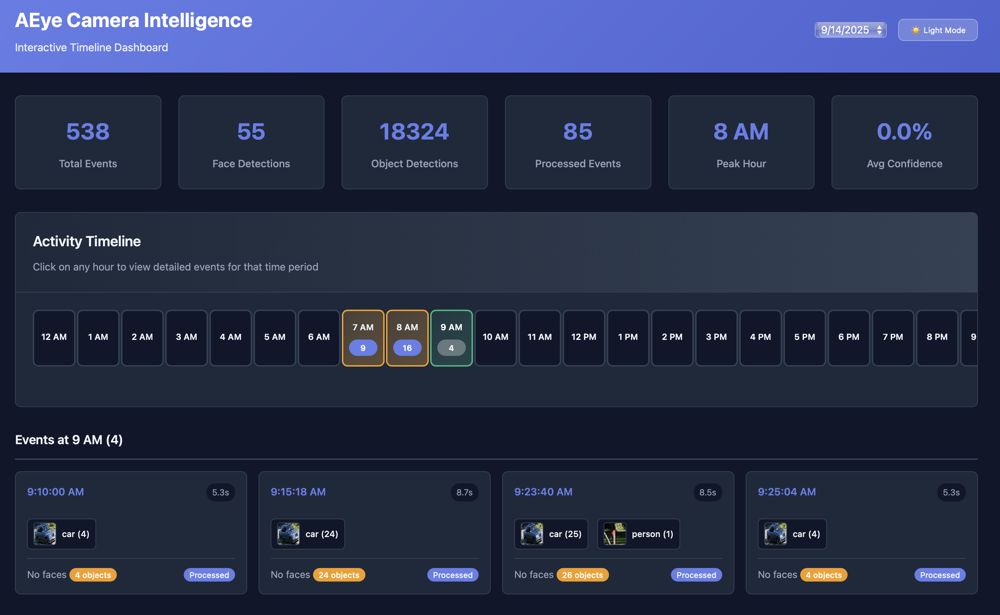

# AEye - Motion Detection & Object Recognition System

AEye: An AI-powered motion detection system with real-time object recognition, face detection, and interactive web interface.



## Features

- **Motion-Triggered Recording**: Smart video recording with pre/post motion buffers
- **Real-time Object Detection**: YOLO-powered object recognition with live thumbnails
- **Face Detection & Recognition**: InsightFace integration for face detection and embeddings
- **Interactive Web Dashboard**: Timeline-based interface with object thumbnails and classes
- **Date-based Organization**: Automatic file and database organization by date
- **Multi-Source Support**: Webcams, IP cameras, RTSP streams, and video files


## Installation

`pip install -r requirements.txt`


#### For insightface:

```
sudo apt update
sudo apt install python3.13-dev
```


## Quick Start

### 1. Start Motion Detection System

```bash
# Default webcam with motion detection
python3 main.py

# IP camera/RTSP stream
python3 main.py --video-source rtsp://192.168.1.100:554/stream

# Custom motion sensitivity and recording settings
python3 main.py --video-source 0 --pre-motion 30 --post-motion 30
```

### 2. Launch Web Dashboard

```bash
# Local access
python3 web_viewer.py --port 3000

# Network access (from other devices)
python3 web_viewer.py --host 0.0.0.0 --port 3000

# View specific date
python3 web_viewer.py --date 2025-09-15 --port 3000
```

Visit http://localhost:3000 to view the interactive timeline with object thumbnails and motion events.

### 3. Optional: Process Existing Videos

```bash
# Process video file for object detection
python3 processor.py video.mp4 --confidence 0.5 --model yolov8s.pt
```

### 4. Optional: run on headless servers:

```bash
python main.py --video-source  rtsp://192.168.6.244:554/11 --headless
```


## Web Dashboard Features

### Interactive Timeline
- **24-Hour View**: Hourly activity blocks with event counts
- **Object Thumbnails**: Live-generated crops from detected objects
- **Object Classes**: Display detected classes (car, person, etc.) with counts
- **Event Details**: Click events for full video playback and detection details
- **Date Navigation**: Easy switching between available dates
- **Responsive Design**: Works on desktop and mobile devices

### Motion Event Cards
- **Real-time Thumbnails**: Object crops generated from video frames
- **Detection Summary**: Face count, object count, and processing status
- **Class Grouping**: Multiple detections of same class grouped together
- **Video Playback**: Integrated video player for each motion event

## YOLO Model Options

| Model | Size | Speed | Accuracy | Use Case |
|-------|------|-------|----------|----------|
| yolov8n.pt | 6.2MB | Fastest | Basic | Real-time, low power |
| yolov8s.pt | 21.5MB | Fast | Good | **Recommended balance** |
| yolov8m.pt | 49.7MB | Medium | Better | Higher accuracy needs |
| yolov8l.pt | 83.7MB | Slow | High | Quality over speed |
| yolov8x.pt | 131.4MB | Slowest | Best | Maximum accuracy |

## Data Organization

```
data/
├── db/
│   └── detections.db           # SQLite database with motion events, faces, objects
├── videos/                     # Motion-triggered video recordings
│   ├── 2025_09_15/
│   │   ├── 20250915_073949.mp4 # Timestamped motion events
│   │   ├── 20250915_074016.mp4
│   │   └── 20250915_074244.mp4
│   └── 2025_09_14/
│       └── [previous videos...]
└── images/                     # Optional: exported frames/crops
    ├── 2025_09_15/
    └── 2025_09_14/
```

### Database Schema

**motion_events**: Motion detection events with video references
- Video file paths, timestamps, duration
- Face count, object count, processing status

**face_detections**: Face detection results with crops and embeddings
- Linked to motion events, confidence scores, bounding boxes
- Face crop images stored as binary data

**object_detections**: Object detection results with classifications
- Class names (car, person, etc.), confidence scores, bounding boxes
- Linked to motion events for thumbnail generation

## Command Line Options

**Motion Detection System (`main.py`):**
- `--video-source`: Video source (webcam index, file, or RTSP URL) (default: 0)
- `--output-dir`: Base output directory (videos/, images/, db/ created inside) (default: data/)
- `--pre-motion`: Seconds to record before motion (default: 30)
- `--post-motion`: Seconds to record after motion (default: 30)
- `--buffer-duration`: Circular buffer duration in seconds (default: 60)
- `--fps`: Recording frame rate (default: 30)
- `--headless`: Run without video display (for servers/background processing)
- `--no-gpu`: Disable GPU acceleration for face detection
- `--image-interval`: Seconds between periodic image captures (default: 600)
- `--log-level`: Set logging level (DEBUG, INFO, WARNING, ERROR)

**Web Viewer (`web_viewer.py`):**
- `--base-path`: Data storage path (default: data)
- `--date`: Specific date to view (YYYY-MM-DD format)
- `--host`: Host to bind to (default: localhost)
- `--port`: Port to bind to (default: 3000)
- `--debug`: Enable debug mode

## Current Setup Examples

### Mac Setup (Local Development)

```bash
# Start motion detection with IP camera
python3 main.py --video-source rtsp://192.168.6.244:554/11

# Launch web viewer
python3 web_viewer.py --port 3000
```

### Linux Setup (Server/Remote)

```bash
# Start motion detection in headless mode (no display)
python3 main.py --video-source rtsp://192.168.6.244:554/11 --headless &

# Launch web viewer for network access
python3 web_viewer.py --host 0.0.0.0 --port 3000
```

### Headless/Server Mode

```bash
# Run without video display (perfect for servers or SSH sessions)
python3 main.py --video-source 0 --headless

# Background processing with custom settings
nohup python3 main.py --video-source rtsp://camera --headless --log-level INFO > aeye.log 2>&1 &
```

### Camera Configuration

```bash
# Ctronics camera example
rtsp://192.168.6.244:554/11

# Generic RTSP format
rtsp://[username]:[password]@[ip]:[port]/[stream_path]
```

## Recent Updates

### v2.1.0 - Enhanced Web Interface
- ✅ **Object Thumbnails**: Real-time object crop generation from video frames
- ✅ **Class Display**: Show detected object classes (car, person, etc.) with counts
- ✅ **Video Path Fix**: Resolved 404 errors for video serving endpoints
- ✅ **Interactive Cards**: Enhanced motion event cards with visual previews
- ✅ **Timeline Navigation**: 24-hour activity timeline with hourly event counts

### v2.0.0 - Motion Detection System
- ✅ **Smart Recording**: Motion-triggered video recording with circular buffers
- ✅ **Face Detection**: InsightFace integration with crop storage
- ✅ **Object Recognition**: YOLO integration for real-time object detection
- ✅ **Database Integration**: SQLite storage for events, faces, and objects
- ✅ **Web Dashboard**: Interactive timeline and event viewer

---

<!--
## Legacy Docker Configuration (Archived)

### Build and Setup
```bash
./docker/docker-run.sh build
```

### Run Services
```bash
./docker/docker-run.sh both 0 --record --confidence 0.5
./docker/docker-run.sh both rtsp://camera --confidence 0.3
```

### Raspberry Pi Optimizations (Archived)
```bash
./docker/docker-pi.sh both 0 --record --confidence 0.4
./docker/docker-pi.sh both rtsp://camera --frame-skip 3 --confidence 0.4 --resize-factor 0.5
```

### Legacy Commands (Archived)
```bash
# Legacy processor
python3 processor.py rtsp://192.168.6.244:554/11 --continuous --record

# Legacy face detection
python facedetect.py --source-db data/db/detections_2025-09-11.db
python web_faces.py --face-db data/db/faces_detections_2025-09-11.db
```
-->